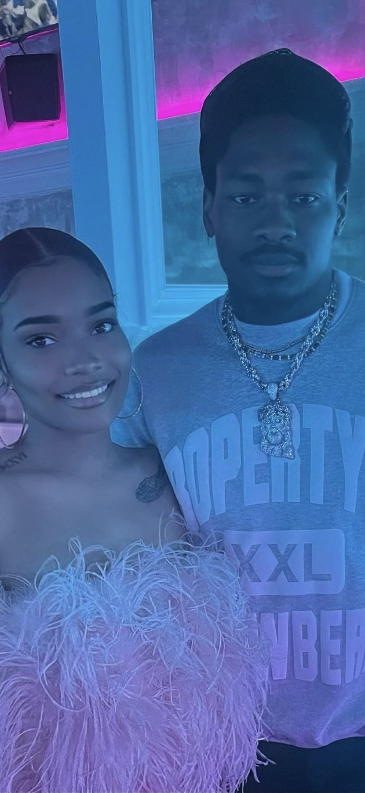

# How to be work with Bryana:

### When do I like to take meetings:
*I’m generally flexible when it comes to taking meetings because I understand the importance of it. However, if I had a choice, I’d prefer to schedule them after lunch or toward the end of the day when I can focus better and wrap up discussions without disrupting my work.*

### What days would I like to work?
*I’d like to work every day except Friday and Saturday. Maintaining a good work-life balance is important to me. These will allow me to take care of personal responsibilities and make time for other aspects of my life. *

### What’s the best way to communicate with me?
*I'm a very direct person, so the best way to communicate with me (especially for important information) is in person. For less critical matters, email, Microsoft Teams, or Google Chat work just fine.*

If I don’t respond, try:

If its an emergency, I'm very open enough to accept via text messages.

### How do I like to receive feedback?
*Coming from a financial and customer service background, I’ve grown to really appreciate in-person one-on-one feedback. I find it to be highly effective for clear communication and improvement.*

### What makes me grumpy?
*I have a Type A personality, and one of the things that frustrates me the most is not being punctual. Being on time is very important to me, and I commit myself to that standard everytime. 

## Cool things about Bryana:

### Topics I’m always happy to talk about:
*📺 TV Shows/Movies (e.g. Breaking Bad, Sopranos or Game of Thrones)*

*🎼 Music (e.g. R&B, Hip-Hop and Rock)*

*✈️ Traveling*

*🏍️ Motorcycles*

*🏠 Interior Designing*

*😃 Michael B. Jordan*

*🌩️ Harry Potter*

### Some of my Favorite Things:

*🏈 Favorite Sports Player: Steffon Diggs/Jason Tatum 🏀* 

*🎱 Favorite Color: Black* 

*🍕 Favorite Food: Lalo* 

*🏖️ Favorite Places: New York City* 

