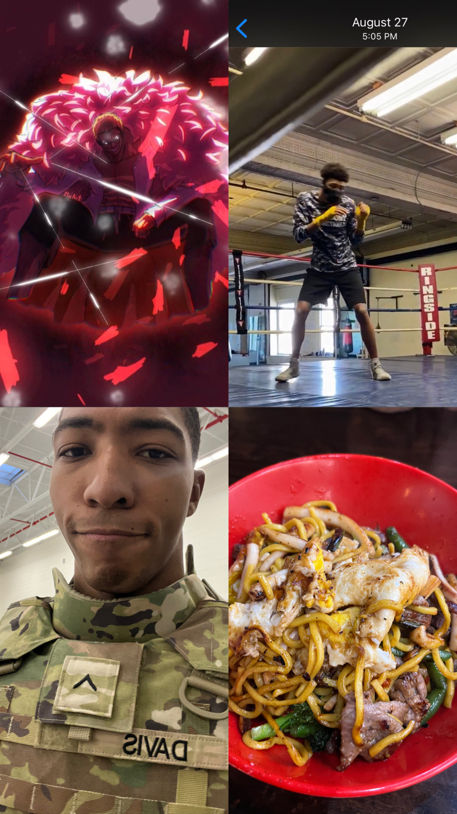

# Davis D. README

## Who is He??

Davis is a 20 year old man who serves in the army but, is also in search for his adult career. Born in Chester PA, Davis has seen the harsh realities of the world to those who let it's influence dictate their lives. His parents moved out of the city in hope he would have a prosperous and successful life which brings him here... An aspiring Software Engineer willing to sacrifice anything for success and stability in said field.

### The Motive

 I've had the pressure on me since my early days as being referred to as the golden boy, Mr. Perfect, or Blessed by God. As well as all family members from grandparents to distant cousins all being compared to me or being told to be like me. This pressure only means failure isn't an option!

## The Drive

### What I do to be a productive Man and U.S Soldier

* 1-2hr workout everyday
* R&B/Soul throughout the day to calm my mind
* A great breakfast. I'm a foodie so i need a meal to get going!
* 1hr of meditation or reading the word
* Watch anime. ONE PIECE is Peak!!

## Cool Stuff

* I've played over 8 sports... Boxing, Basketball,and Track to name a few.
* I was a Golf instructor for Education First Golf.
* I'm in the Military, Army Guard.
* I was ranked top 20 in the state of Delaware for wrestling!
* I am skilled in being a physical trainer & Masseur(Male massage practitioner)

## The Moments

## Reach Me

You can reach me via. <a href="https://www.linkedin.com/in/davisdw2004">LinkedIn</a>
