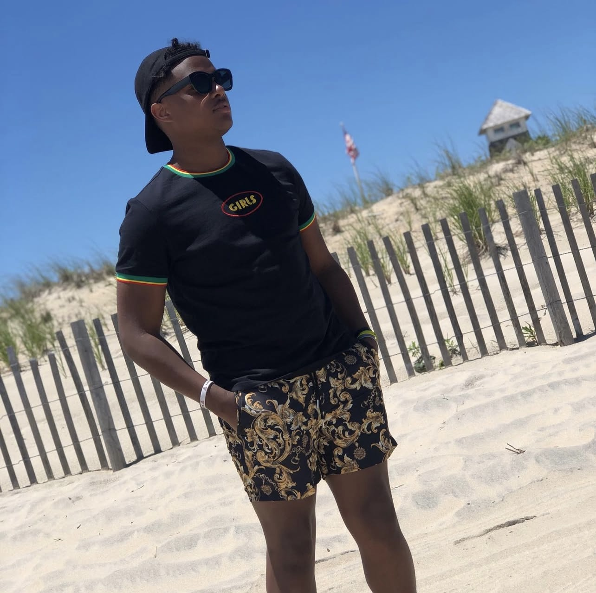

# Justin Eklund README
# Introduction
Hello, my name is Justin Eklund. I'm an aspiring coder from Middletown Delaware. I was previously working at apex concrete which is a flooring installer. I helped install floors to the customers expectations as well as help manage the work area. I hope to make an impact somewhere in the coding or software engineering indusrty using my creativity and eventual expertise of the industry. I've also have been making music for almost 5 years. Music is something that I'm very passionate about. It helps me take my mind off things and allows me to express myself in ways that I would not do otherwise.

## Prerequisite
These are the things I need to boost productivty in the work space:
Relatively quiet workspace. I'm easily distracted, so having a focused workspace works best for me
Visual learner. I learn things or can comprehend things better seeing a visual example. Visual examples give me the most amount of details so I can take the best steps moving forward.

## Best ways to reach me
Not an early bird at all. Preferably not mornings, but if it has to be a morning, after 9am. Email is the most formal way to reach me but a text would always be the quickest. (I'm a 2000's baby so text is what I grew up with) Another way is by a social media DM. I check all my streams of communication daily, but you will most likely get an answer quicker on an off day through a text.

## Other fun facts to know
* I have been making music since 2018 and I make all diffrent kinds of music
* I have been on the Temple field during a game for a visit for football. (Temple vs Buffalo a while back)
* There's a post on Instagram with over 40,000 views featuring one of my songs
* One of my songs has almost 10k views on Instagram.
* I played football up until I graduated high school
* I played DE, RB, and LB.
* I played for Salesianum my freshman year but finished at appo.
* Made All State team for Delaware my senior year.
* I have flown a plane before through CAP (Civil Air Patrol). It was a small, private plane, that I helped steer while it was in the air.
## Photo of me

