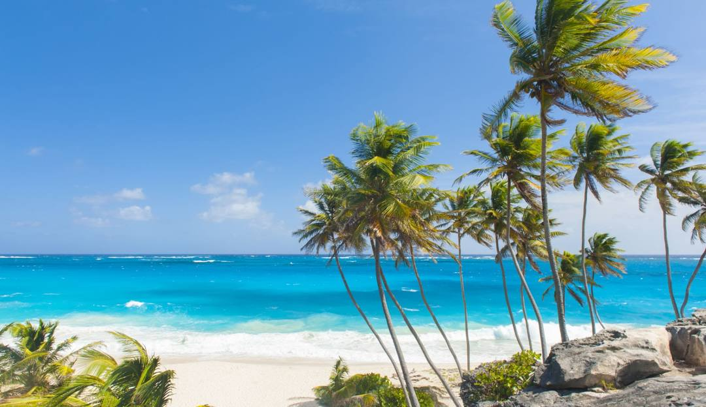
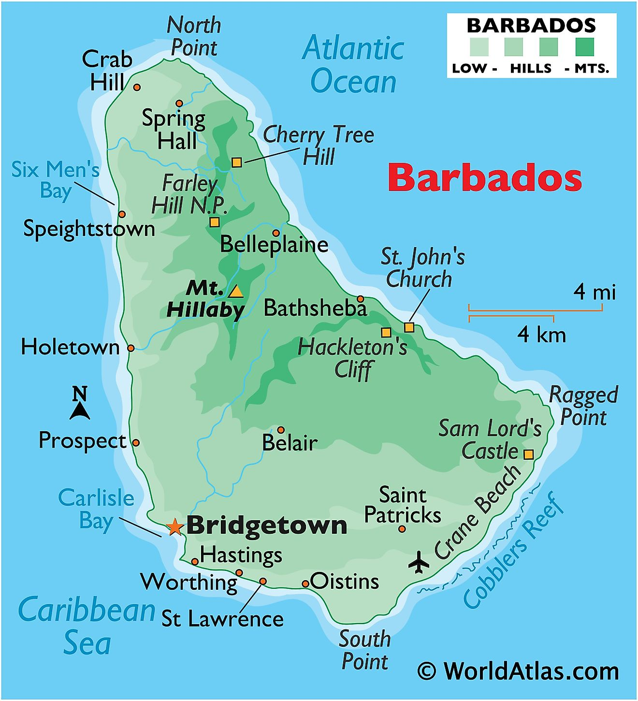

# Getting to know ME...
___

*Hello* I am Chanel Hutt, a Delaware native, and I love me. I hope you love you too. I am believer of energy and positivity. I developed a knack for optimism and adventure in my youth. 
 

## How can we work well together
*My work preferences are communicate respectfully and be positive. I am a solution based individual. I want to emphasize ways to solve an issue rather than giving life to the problem. Conflicts or disputes should be handled, in my opinion, like a pro/con list. If you understand that everyone has a perspective and different analytical skills life will flow easily. Just be mindful.*

### My dream schedule:
I am a morning person but I can do nights. *Having it my way, I would work Tuesday thru Thursday 7am - 7pm.* What you will expect from me during in-office workdays are warm greetings, readiness and humor. I am available during my scheduled business hours. 

# Getting to know all about ME...

### What’s the best way to communicate with me:
I prefer text/chat over email with certain topics. I prefer in-person meetings over chats. I consider myself approachable, resourceful, and helpful, so I do not mind being interrupted while my headphones are on.

If I do not respond, try: AGAIN

### I'd love to help you with ____
Creative writing, proofreading or editing written work. Rehearsing a presentation. Lastly I'd love to help you with meeting your goals. Absolutely do not mind giving you the knowledge I have. 

### What makes me grumpy?
Hunger and inconsideration
	
### How do I like to give feedback?
*In-person and when I am asked*

### How do I like to receive feedback?
*In-person and in private & also emails are sufficient*

### One of my goals for the coming year:
Is to be proficient in area of tech that I am passionate about or intrigued by. Certification in multiple disciplines and making a great salary. 

### Topics I’m always happy to talk about:
*Movies, tv series, and traveling. I love talking herbs, quantum theories, and inventions(new ideas).*

### Other things you might want to know:
* I really like Marvel Studios movies/tv series, learning new things, and interacting with people.
* My favorite baked good: Banana nut bread
* My birthday: New Year's Eve
* My coffee order: Not coffee but green matcha latte
* My hometown: Wilmington, Delaware
* My favorite thing to do: Travel             
* My favorite place that I traveled to: Barbados (which is pictured below)

 

