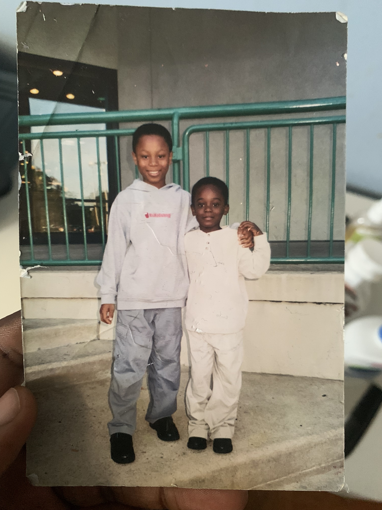

# How to work with David Adenaike 
* This document helps others better understand me. From important facts about me to fun facts.
## My work hours 
I prefer to work early morning to mid-afternoon. Granted I am naturally a night owl but I've been trying to be more of a morning person. Others should expect to work with me during the morning and noon. I most times am unavailable during the weekend and late evenings.
## What's the best way to communicate with me?
Best way to contact me is via text messages. I might not reply right away but it is the most reliable way to get in touch with me quickly. While working, I prefer chats (Slack, Teams, etc), I try not to meet in-person unless absolutely necessary. Only because I can be antisocial at times. Most times it is okay to interrupt me when I have headphones, I'll let you know if otherwise.
## I'd love to help you with 
Anything you are genuinely passionate about! It rejuvenates me seeing others passionate about their interests/hobby. I might not be good at what you are passionate about, but would still like to help if needed.
## What makes me grumpy
Biggest one for me is hypocrisy in others. Besides that, general unexpected changes get me grumpy as well.
## How do I like to give feedback
I like listing things that worked well and that didn't work well as feedback. Along with recommended ways to improve. Generally would like to give feedback in person
## How do I like to receive feedback?
I don't have a preference as to how I receive feedback. I just want the feedback to be very precise. What and how I can work on to become better. 
## One of my goal for the coming year:
Biggest goal I have is to break into tech. 
## Other information about me
- My favorite anime is Hunter X Hunter
- I have a pet greyhound
- My birthday is October 8th 
- My least favorite food is tomatoes 
- My coffee order: Iced latte with 3 creams, 4 sugar, cold foam on top
- My hometown: Upper Darby PA
- Sports: Soccer, and Football 
- My favorite and most treasured photo: (an old photo of my older brother and I as kids)

