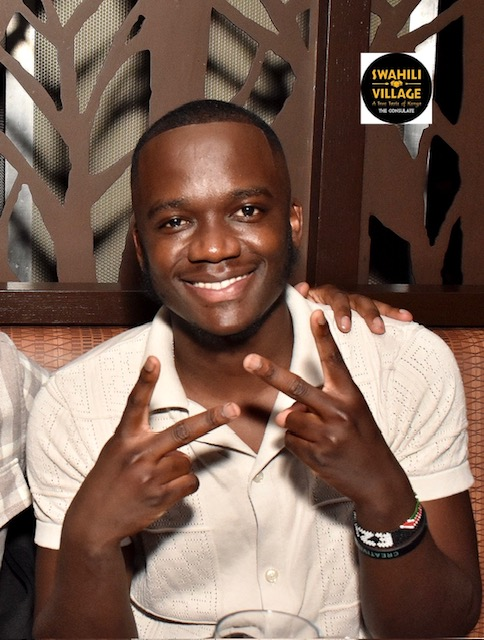

# 👋 **Hello, I'm Ezra Nyabuti**

I’m an aspiring Software Engineer / Data Engineer passionate about data, automation, and building scalable solutions. With a background in IT Field Service Engineering, I have hands-on experience working in the medical technology sector, where I specialized in software upgrades, preventative maintenance, and troubleshooting complex systems.

I am currently focused on refining my data engineering skills by building automated data pipelines and exploring cloud-based solutions. Additionally, I am developing a deeper understanding of big data technologies, database optimization, and cloud infrastructure to enhance my technical proficiency.

## 🚀 Career Goals
I am seeking opportunities as a Data Engineer where I can contribute to data-driven solutions and grow in a collaborative environment. I am particularly interested in cloud technologies, real-time data processing, and AI-driven automation. My goal is to bridge the gap between software development and data engineering, creating efficient and scalable systems that drive business insights.

🎓 Education: Bachelor’s in Computer Science (Class of 2023)

💡 Interests: Software Engineering, Data Engineering, Cloud Computing (AWS), ETL Pipelines, AI & Automation

🔍 Currently Seeking: Software Engineering and Data Engineering roles

## 🛠️ Technical Experience
I have minimal experience with Python, SQL, AWS, and ETL Pipelines, but I am actively learning and working on projects to strengthen my skills.

## 📂 Projects
AI-Powered Job Board Scraper – Automated system that scrapes job listings and stores them in a SQL database

Data-Driven Newsletter (AI Pulse) – AI-researched newsletter on emerging AI trends

## 🎵 Hobbies & Interests
* 🎤 Concerts: I love experiencing live music and attending concerts. (Afronation concert...)

* 🎶 Music: Amapiano & slow Afrobeats are my go-to genres. (I like Rema.)

* ✈️ Traveling: Exploring new places and cultures excites me. (Nairobi is my favourite travel destination)

* 🌍 Fun Fact: I can speak three languages fluently! (English, Swahili, Kisii).

** I used to love playing video games but i grew out of it

## 📫 Connect with Me
GitHub: EzraNyabuti

LinkedIn: Ezra Nyabuti

*Note: I used chatGPT for better visual layout and better documentation/grammer.*
<!---
enyabuti/enyabuti is a ✨ special ✨ repository because its `README.md` (this file) appears on your GitHub profile.
You can click the Preview link to take a look at your changes.
--->
