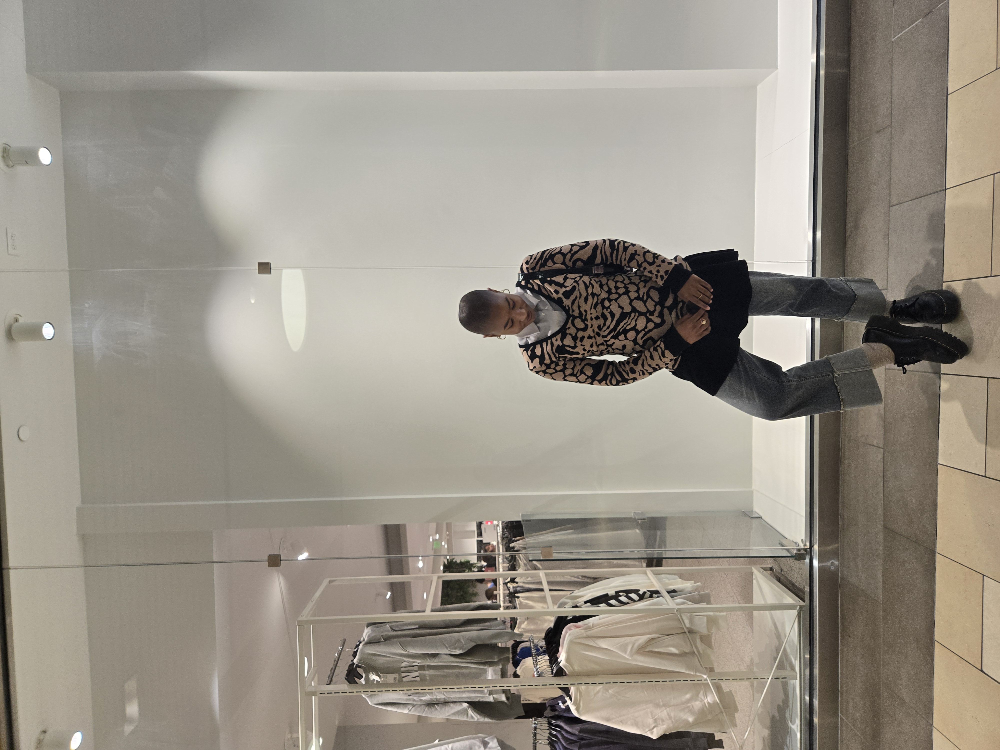
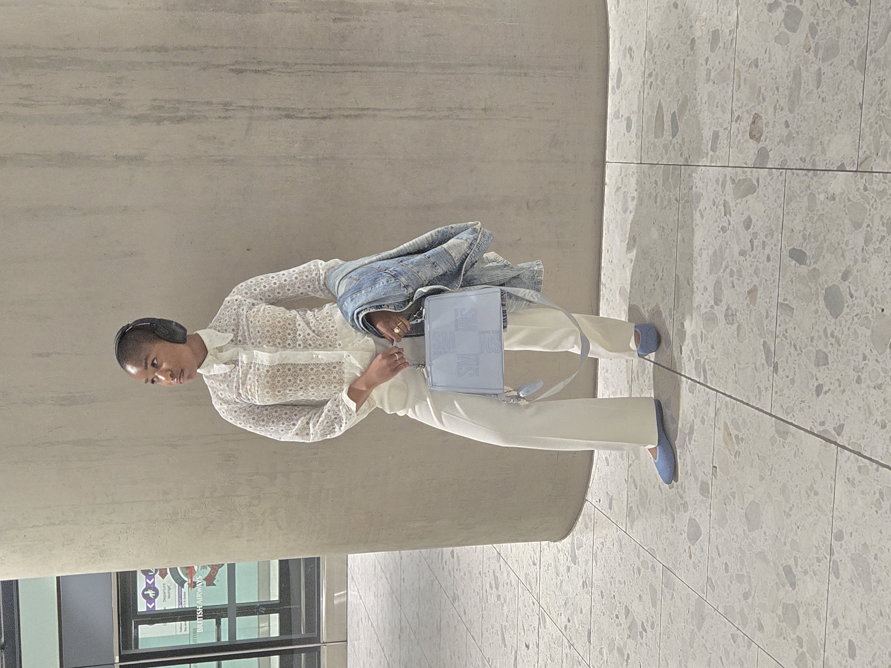
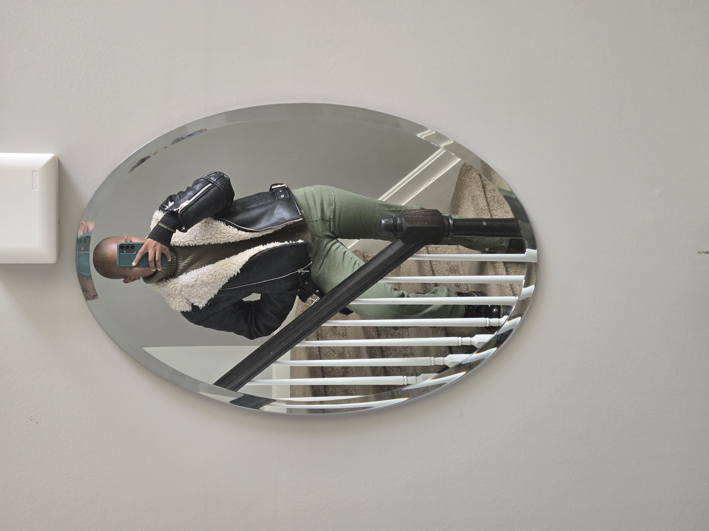

# Hello, I'm Karen Alabi! 

## 💁🏾‍♀️  About Me  💁🏾‍♀️
I’m an Aircraft Electrical and Environmental Systems Engineer in the Air Force Reserves, where I’m entrusted with the vital task of maintaining the electrical and environmental systems of aircraft. My role involves troubleshooting, removing and replacing malfunctioning components, and performing cryogenic maintenance on mobile aircraft servicing units. Every opportunity I have to be an aircraft maintainer brings new challenges, and I thrive on resolving complex problems and contributing to the safety and efficiency of the aircraft I work with.

I have a deep passion for staying on the cutting edge of technology while serving others. The thrill of solving problems and seeing the solutions unfold before my eyes is what drives me. Whether it's ensuring aircraft systems run smoothly or building something from scratch, I'm always excited for the next challenge.

## 💡 Beyond Engineering 💡
When I’m not immersed in engineering or programming, I’m exploring other aspects of my life that keep me inspired. I’m passionate about faith and fashion. I enjoy listening to a variety of Christian music and watching podcasts to enrich my spiritual life. Some of my favorite artists include Dunsin Oyekan, Madison Ryan Ward, and Kaestrings. Currently, my go to podcasts are In Totality with Megan Ashley, With the Perrys, and Give Me an Answer with Cliffe Knechtle. 

Beyond tech, I love hands-on creativity. I am always exploring new DIY projects like crocheting, knitting, and fashion styling. For me, fashion isn’t just about clothing — it's a form of self-expression and creative outlet that allows me to bring ideas to life in unique ways.

Another big passion of mine is travel. So far, I’ve visited six countries, with many more on my list. I’m always eager to dive into new cultures, connect with people, try new foods, and experience life through a different lens. 

## 👩🏾‍💻 How I Work 👩🏾‍💻

I am a visionary thinker who thrives in collaborative environments. Whether I’m working solo or as part of a team, I always give my best and strive for continuous improvement. I believe that learning is a lifelong journey, and I’m always excited to connect with others to share knowledge and experiences, tackle challenges, and grow together.

## 📧 Best Way to Reach Me 📧

 I enjoy meaningful conversations and connecting with people in person. However, the most reliable way to reach me is via email. I check my inbox regularly and strive to respond promptly. 

If you’re on LinkedIn, feel free reach out. I'd love to connect! I’m always open to professional networking.

My Linkedin: https://www.linkedin.com/in/karen-alabi-9b03b1215/

** Note: If you can't reach me in person or through my email, I am reachable via text message.

## 🌅 My Routine 🌅

My mornings always begin with prayer and Bible study -- to prepare myself for the day ahead. After that, I dive into one my favorite parts of my routine: getting dressed. Funny enough, I find my best outfits are usually the most spontaneous, always featuring a pop of color.

That said, I am **not** a morning person. My brain doesn't fully kick into gear until around 1pm -- that's when I hit my productivity peak. 

Once I settle into work, you'll usually find me with a hot Vanilla Chai Latte in hand. It's my go-to drink and absolute must on busy days. And since I love tea, if I'm not sipping on a chai latte, you can bet there's a cup of non-caffeinated tea nearby.

## 🤩 Fun Facts 🤩
-  I love to capture every moment!

I have a habit of turning ordinary moments into timeless snapshots. If you see my walking down the street and I suddenly stop, it's most likey because I'm taking pictures of something random. I would definitely describe myself as a creative and I always see the beauty in everything. I can find inspiration from just about anywhere.

- I've visited the Eiffel Tower!

I’m a travel enthusiast and I’m always looking for my next destination to explore. One of the favorite places I've been to is Paris, France. As a side note, the bread is amazing there!

- I can speak Mandarin!

I’m constantly learning and currently diving into learning new things. When I was an early teenager, I became obsessed with Chinese and Korean dramas. Since then, I've been teaching myself several languages. I have recently dived back into learning Mandarin. It's one of my favorite languages to learn.

### 📸  A Sneak Peak Into My Life 📸

    

Travel Diaries 

    

