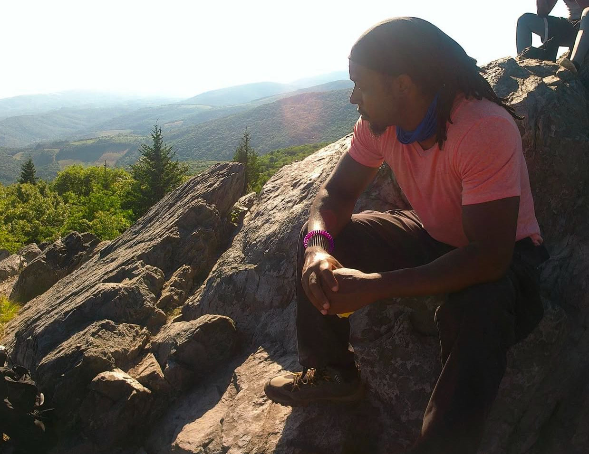
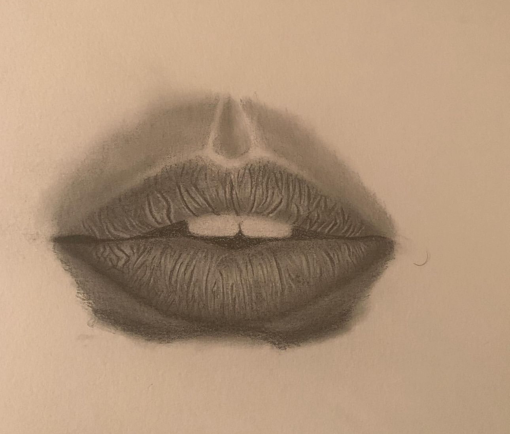
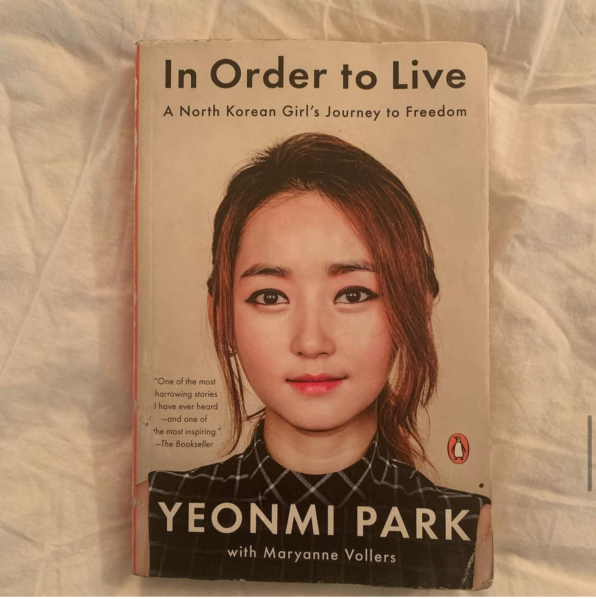
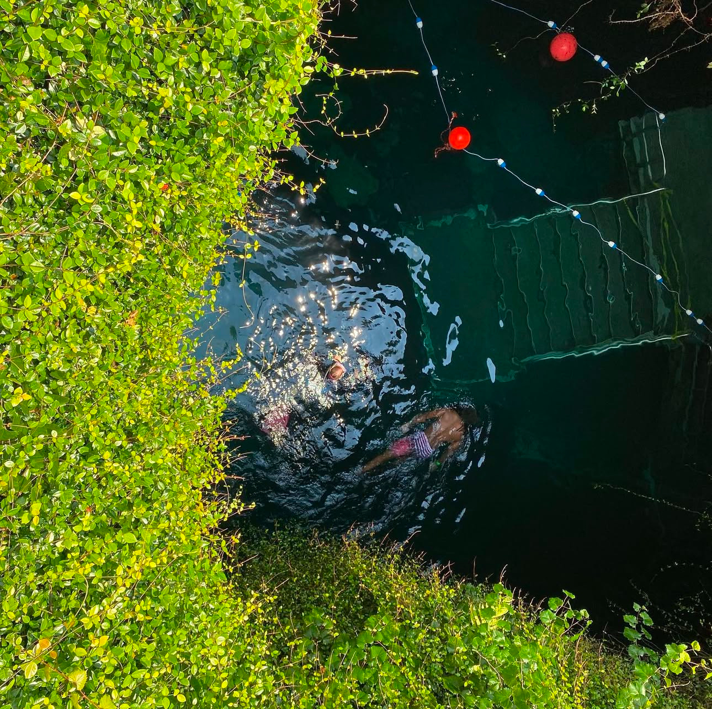
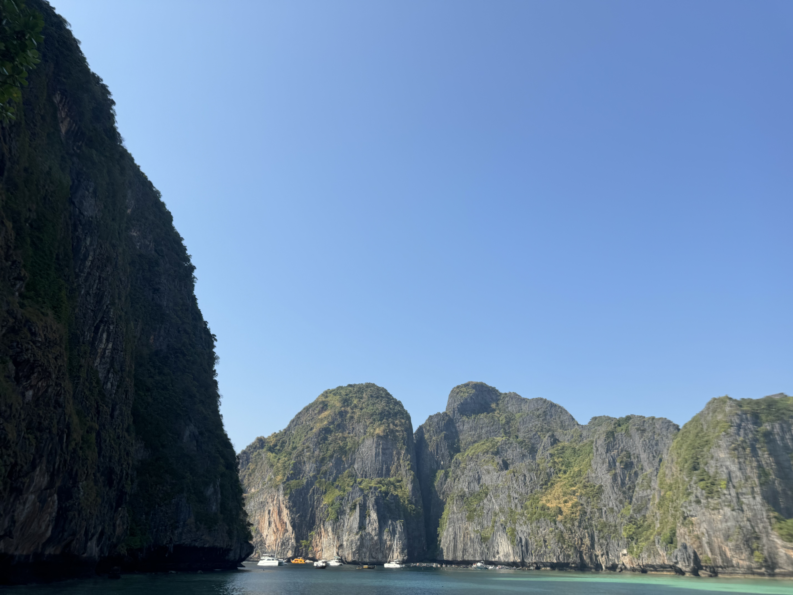

# Montez M Bradley README

## Introduction

I am an aspiring Software Engineer with six  months of experience. Born in Philadelphia, PA going to high school in CHAD which is a art school. We did several murals in Philadelphia. The one most prominent one is the one on the side of childrens hospital. In that school I met with the now famous Quinta Brunson from Abbott Elementary. Throughout the years I fell in love with drawing, painting, Working Out and now coding. I try to to challenge myself daily in workouts and every summer try to climb one mountain. Everyday I am trying to become a better person. 

## Prerequisites

Things I need to be a productive professionally and personally.

* I need a slow morning from 6:30am to 7am otherwise I will be frantic throughout the day.
* I need to workout daily to deal with the stresses of life.
* I need to eat a healthy amount of greens.
* I have to peace and schedule my in life to be at my absolute best. 

## Support 

You can find me on LinkedIn @ <a href="https://www.linkedin.com/in/montez-bradley-62017295">montez bradley</a> If you're hiring for a Software Engineer I am your guy.

## Installation Instructions

* I work best from 9am-3pm
* If  I take an pre workout than I will wired and ready to communicate with everyone

## Fun Facts.

1. I participated in painting 2 murals in Philadelphia both are located in the childrens hospital in Philadelphia Northern Philadelphia.
1. I was a personal trainer for 3 years and Did a powerlifting competition that involved pulling a firetruck.
1. I was a truck driver for 7 years made th e most money I have ever made but wishing to not go back. 
1. I have climbed 4 Mountains in across America . One in Texas, two in New Jersey and one in Virginia.
1. I have swam in 2 Oceans and one cave and all times my heart racing. 

## Photo Gallery

