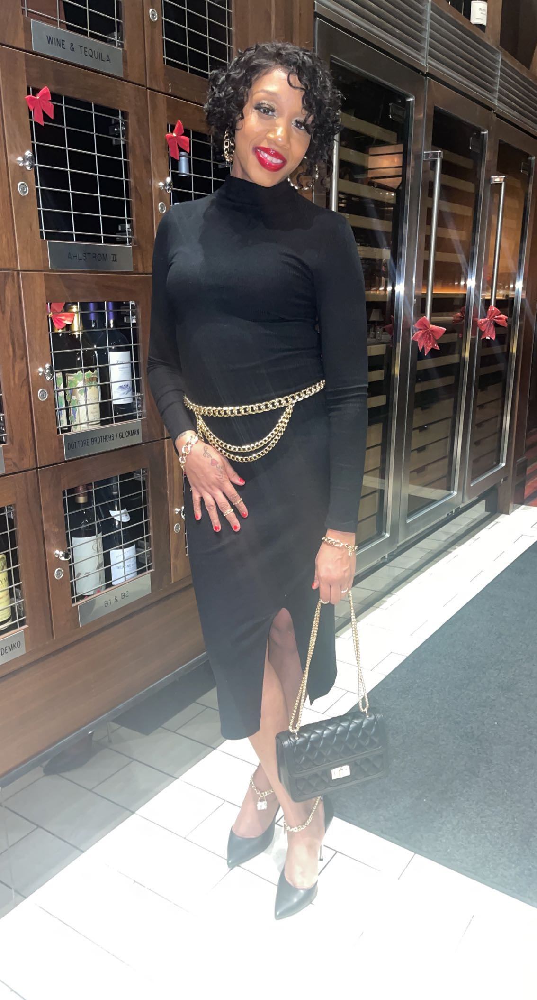

# Knowing Nia 
How to work with Nia P. 

### My work hours:
I am a morning person. Specifically early morning, between 3 & 8am is my usual leisure time. Colleagues should expect to work with me during most business hours, 9am to 6pm. I am available Monday through Friday during those times. I don't prefer to work weekends but I will make an exception on Saturdays. Sundays are strictly forbidden for work.  

### What’s the best way to communicate with me?
I prefer to  email on certain topics in order to have a paper trail, but I am open to communication through text message if needed. I prefer in-person meetings over chats and Zoom. It is OK to interrupt when I have headphones on.

If I don’t respond try calling me on my cell phone.

### How did my interest in tech start?
I was interested in code and decided to enroll in a CS50 class with Harvard. I learned a few fundamentals but overall it was too fast-paced. I then did a course at SNHU wanting to major in Cyber Security, but came to the conclusion that I would prefer to learn in person.

### What makes me grumpy?
I'm usually grumpy when I'm hungry and/or tired. 
	
### How do I like to give feedback?
I prefer to give feedback in person, this way there is no way to misinterpret my tone and my delivery. Which is easy to do when reading.

### How do I like to receive feedback?
I prefer feedback in-person because it's more personable but I'm open to email. I would like feedback as frequently as once a week. More if needed.

### One of my goals for the coming year:
This year one of my goals is to become fluent in code and its terminology. Another goal is to travel out of my country.

### Topics I’m always happy to talk about:
I'm always happy to talk about my experiences in life. The places I've lived, previous jobs and places I've traveled.  I also love talking about my children. 

### Other things you might want to know:

* My favorite baked good: Chocolate cake
* Spouses/partners/kiddos/pets: I have 3 children. (18, 9 & 6)
* My birthday: October 21 #TEAM LIBRA
* Fruit on pizza? I love pineapples on pizza
* My coffee order: Large mocha, iced with 6 creams & 7 sugars 
* My hometown: Born in Brooklyn, raised in Harlem 
* My favorite food: Steak cooked medium well
* My favorite color: Neutral colors (brown, beige, army green)
* My favorite tv shows: Grey's Anatomy, The Resident, The Walking Dead

